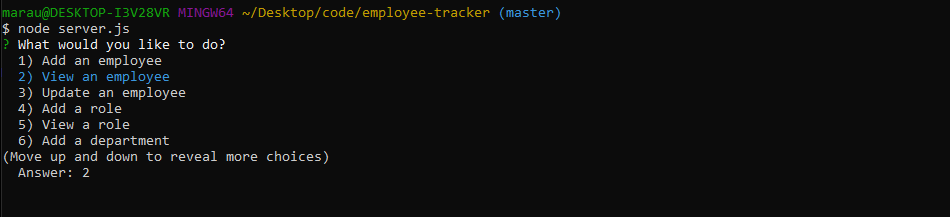
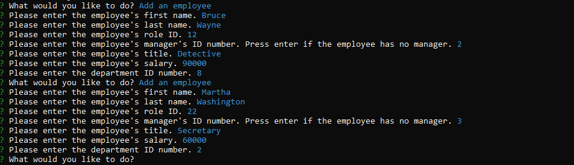
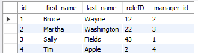
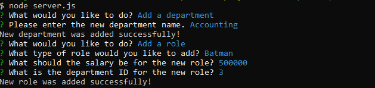

# Employee Tracker

## About

This simple command line application is made for companies to keep an active roster of their employees. The user will use database storage to keep up to date information on their employees, their roles, and also departments within their company. With this tool, a user can view individual information as well as broader information, such as by role, and the user will also be able to update this information.

## Screenshots

The application begins with a simple rawlist for the user to scroll through.

If their database is not already populated, the user can begin by entering information for individual employees.

This information is securely stored in a database, where the user will be able to access later at any time.

The user will also be able to update departments and roles.

## Technology

This application was built using these technologies:

- node
- inquirer
- MySQL

## Links

https://github.com/marauder30/employee-tracker

https://marauder30.github.io/employee-tracker/

## Author

[Nicholas Koch](https://marauder30.github.io/portfolio.html)